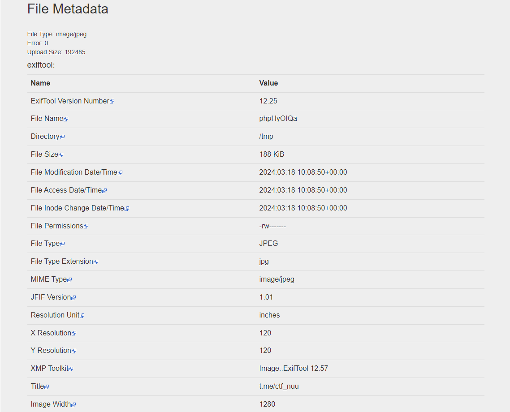
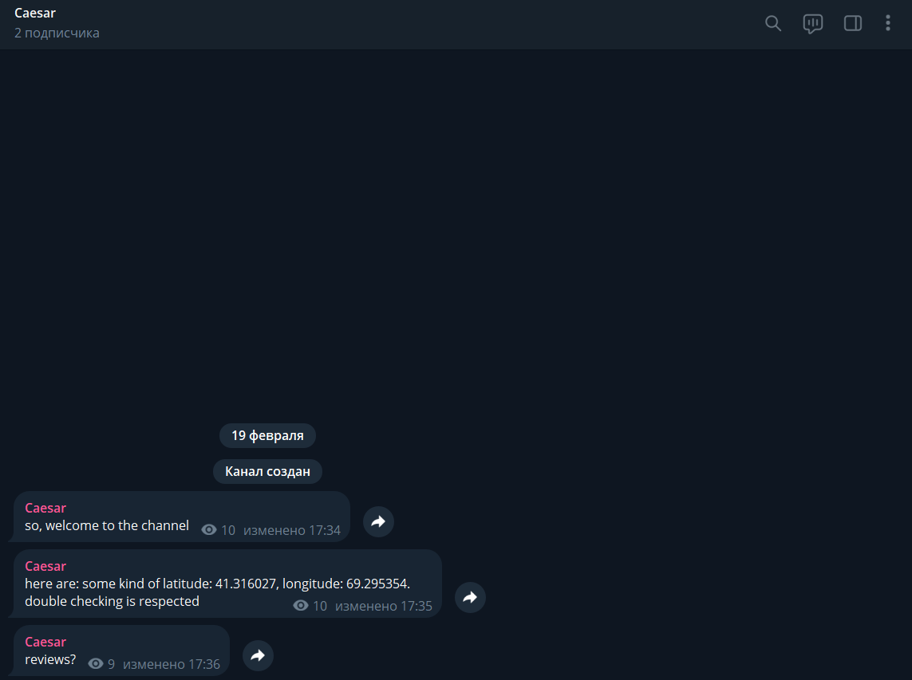
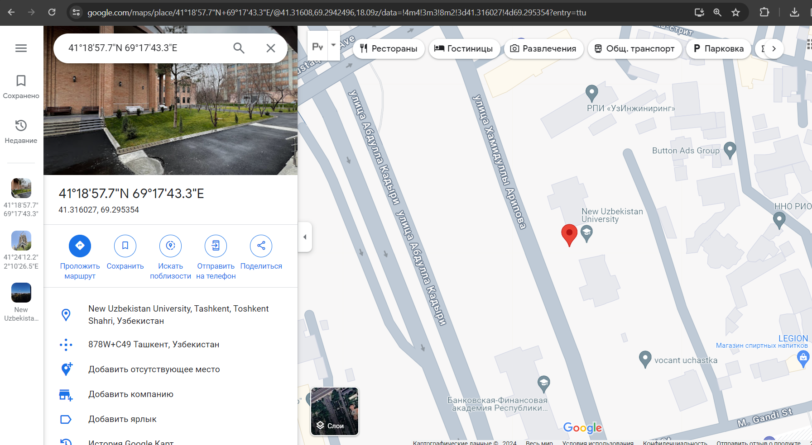
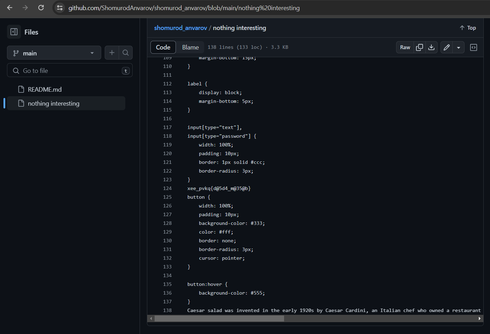
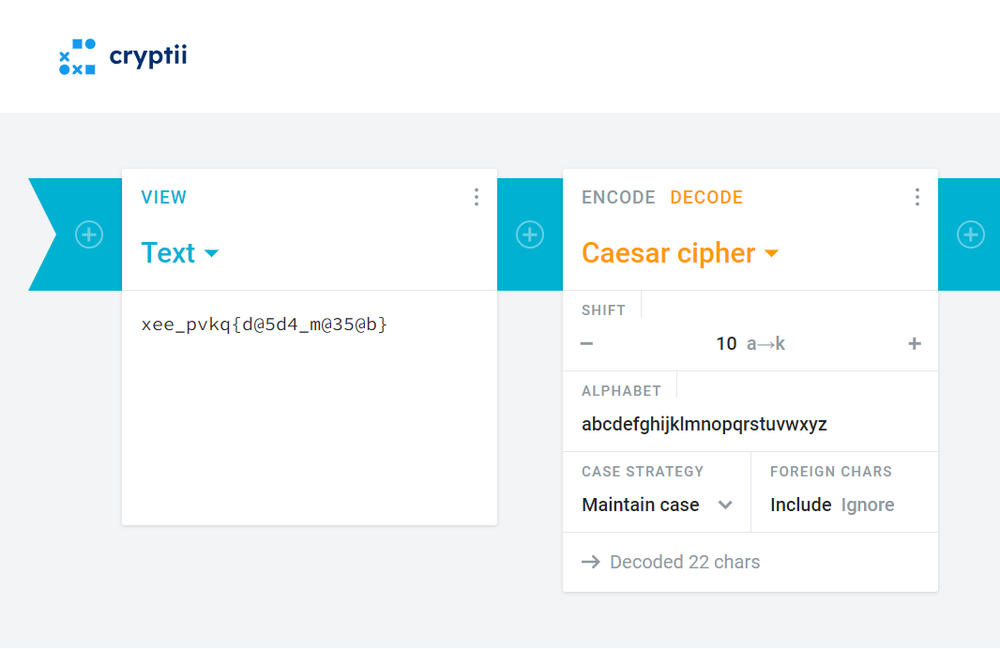

## OSINT
```sh
"OSINT"
Problem: find a flag going step by step
```
Solution:
```
Step 1:
find metadata of the picture using exiftool:
```

where you'll find the link to Telegram Channel
```
Step 2:
```
some messages from user:

```
Step 3:
```
latitude and longitude checking:

lets see reviews of our university:))

Step 4:
twitter profile:

use google dorks to see location of the place from the picture:

we have checked reviews of New Uzbekistan University, lets see reviews of Cesar:
 
Step 5:
from github we found:

lets use Caesar Cipher decoder to decode xee_pvkq{d@5d4_m@35@b}

```
Finally here is the answer:
nuu_flag{t@5t4_c@35@r}
```