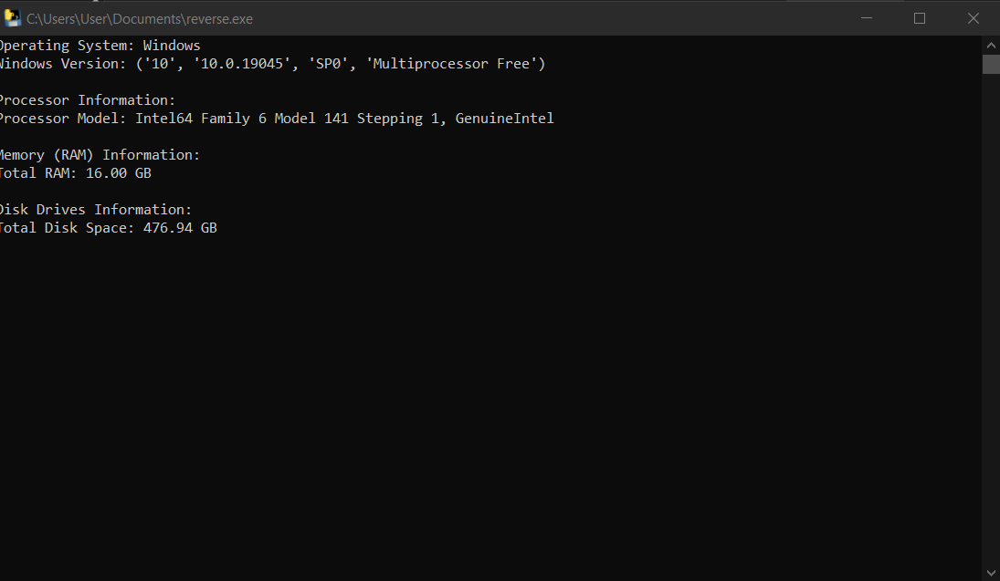
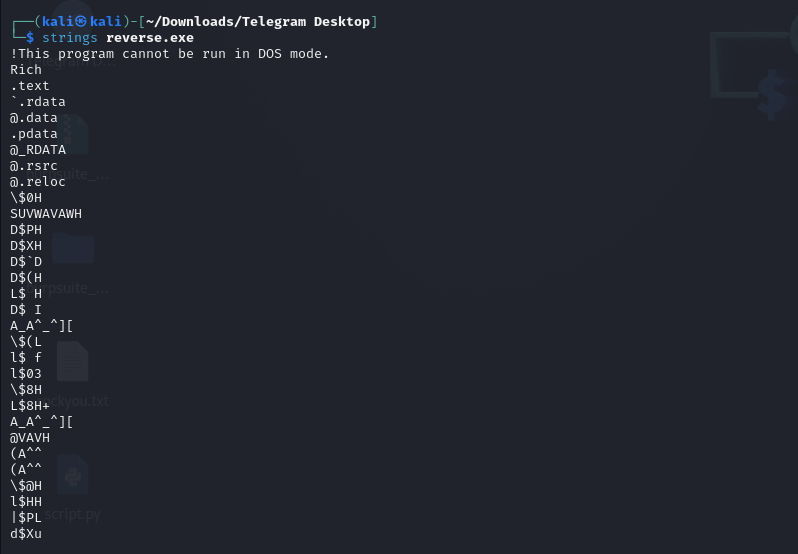
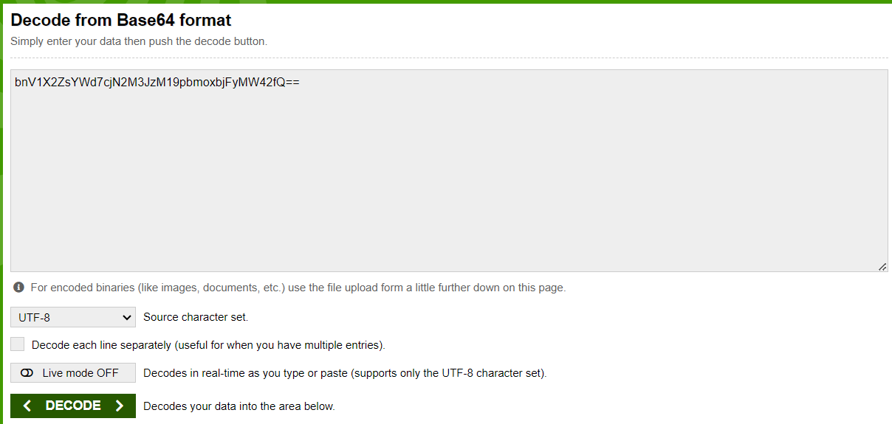

## Reverse Engineering
```sh
"Reverse"
Problem: Find a flag in exe program
```

```
Solution:
 When an application or software is deployed, most developer packages the binary files. But it is good to pack some ASCII text in the binary file. It will be helpful for the users and for the developers to understand more about the executable file.
 1) Use strings command in Linux or open program in notepad:
```

```
2)where you find:
bnV1X2ZsYWd7cjN2M3JzM19pbmoxbjFyMW42fQ==
decode it in base64:
```

```
Answer:
nuu_flag{r3v3rs3_inj1n1r1n6}
```