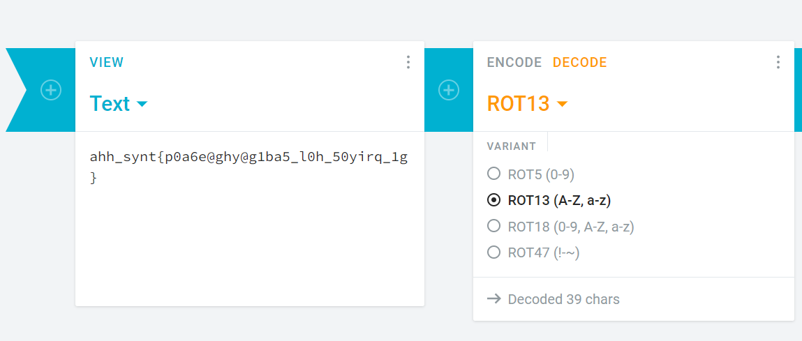
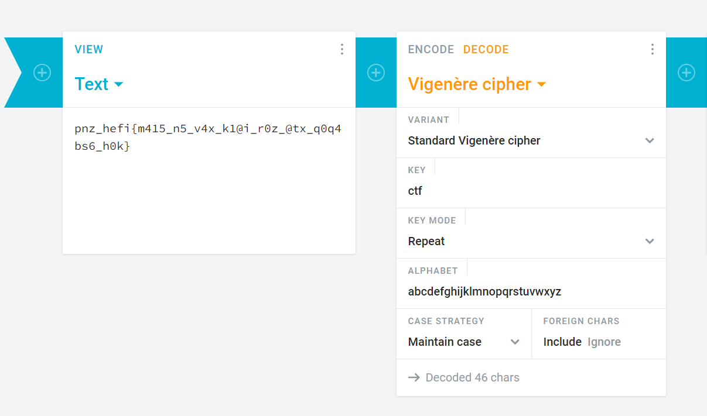
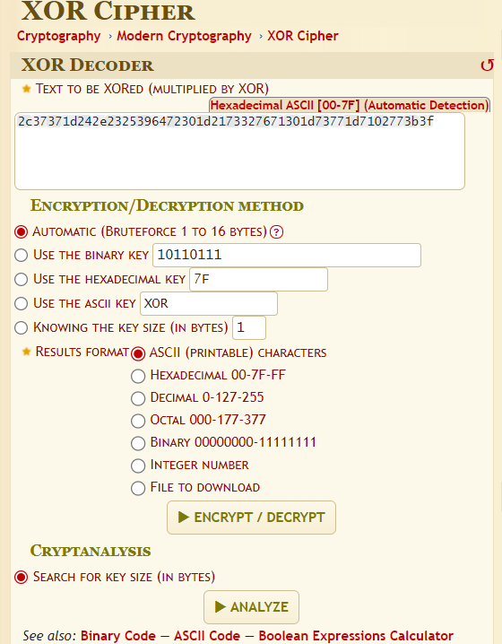
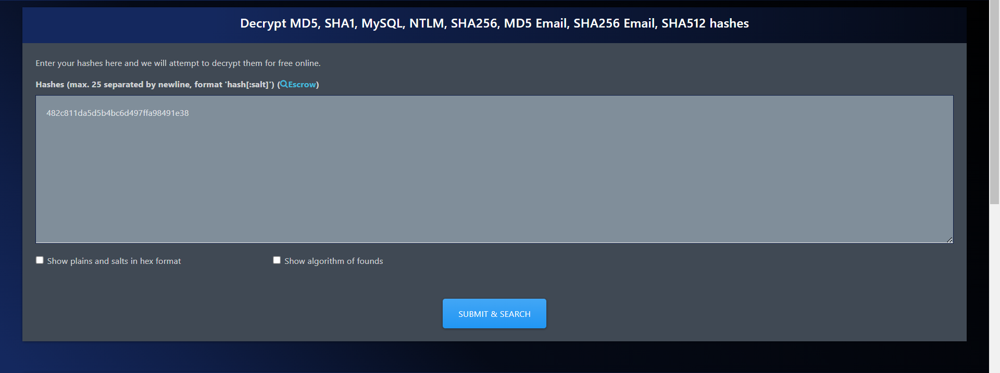

## Cryptography

```sh
"crypto 1"
Problem: Decode
YWhoX3N5bnR7cDBhNmVAZ2h5QGcxYmE1X2wwaF81MHlpcnFfMWd9
```
```
Solution:
1) Decode in base64:
ahh_synt{p0a6e@ghy@g1ba5_l0h_50yirq_1g}
2) Use Caesar Cipher or ROT-13 decoders
```

```
Answer:
nuu_flag{c0n6r@tul@t1on5_y0u_50lved_1t}
```

```sh
"crypto 2"
Problem: Decode
pnz_hefi{m415_n5_v4x_k1@i_r0z_@tx_q0q4bs6_h0k}
using key: ctf
```
```
Solution:
1) Use Vigenere Cipher decoder

```

```
Answer:
nuu_flag{t415_i5_t4e_f1@g_y0u_@re_l0o4in6_f0r}
```
```sh
"crypto 3"
Problem: Decode
2c37371d242e2325396472301d2173327671301d73771d7102773b3f
```
```
Solution:
1) Use XOR Cipher decoder

```

```
Answer:
nuu_flag{&0r_c1p43r_15_3@5y}
```
```sh
"crypto 4"
Problem: Decode
482c811da5d5b4bc6d497ffa98491e38 hash
```
Solution:
1) Use MD5 hash decoders:
```
```

```
Answer:
nuu_flag{password123}
```
