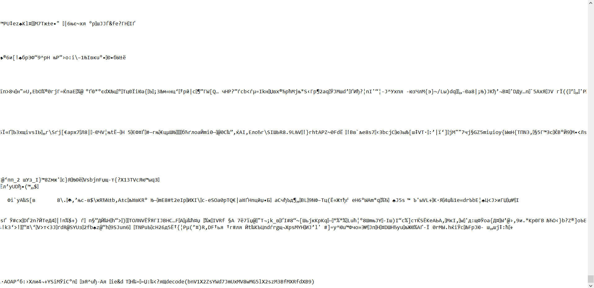
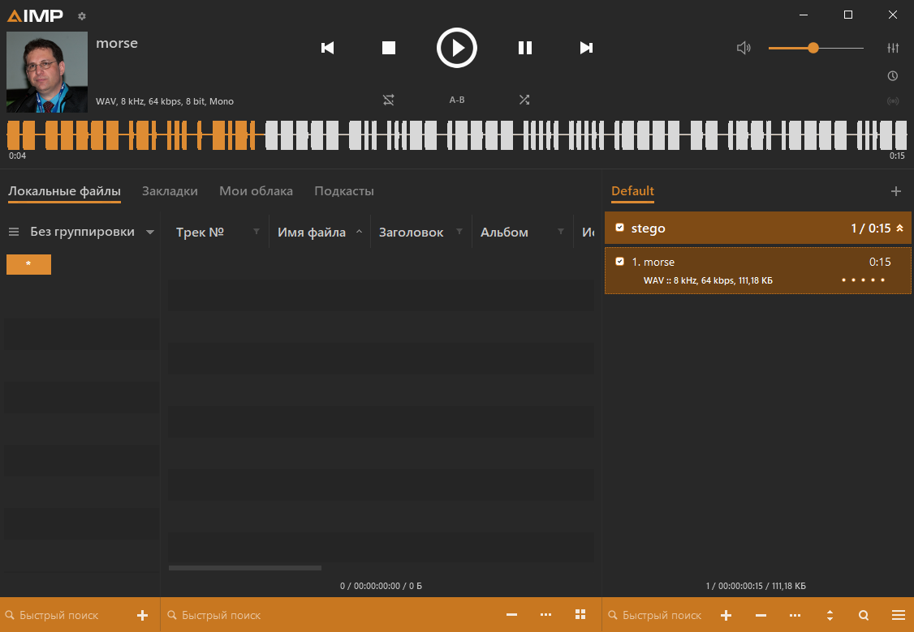
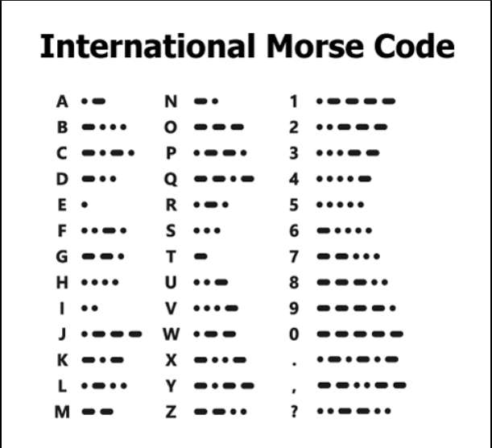

## Steganography

```sh
"stego 1"
Problem: Find a flag in the file
```

```
```
Solution:
1) use strings command in Linux or just open the picture in notepad:
```
```

```
2)Decode in base64 bnV1X2ZsYWd7JmUxMV8wMG5lX2szM3BfMXRfdXB9
Answer:
nuu_flag{&e11_00ne_k33p_1t_up}
```
```sh
"stego 2"
Problem: find a message in morse code
```

```
Solution:
use online morsecode translators or just use this cheatsheet))
```

```
Answer:
nuu_flag{m0rsec0d31551mp13}
```
