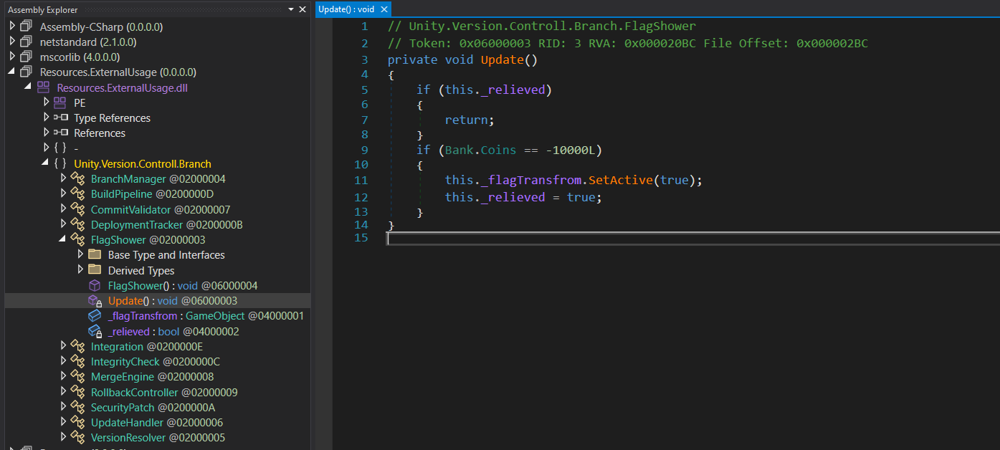
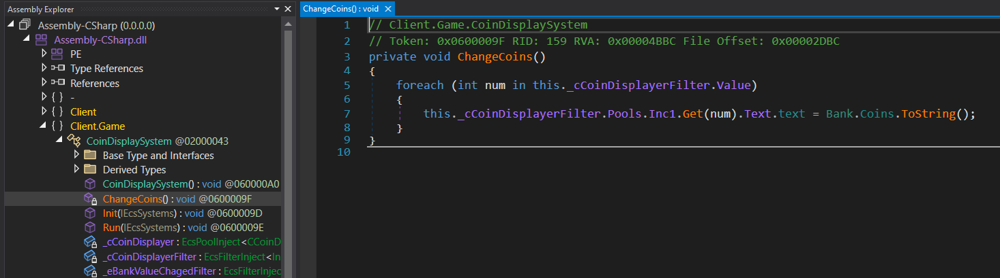
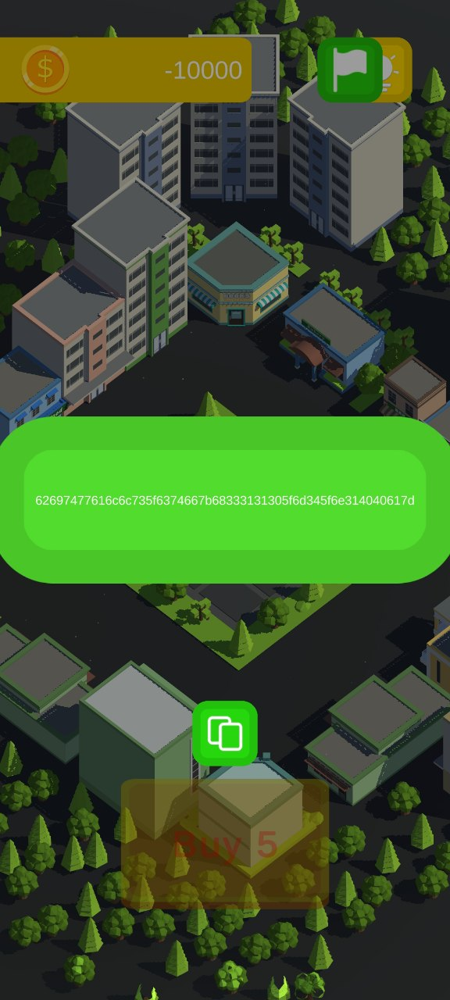
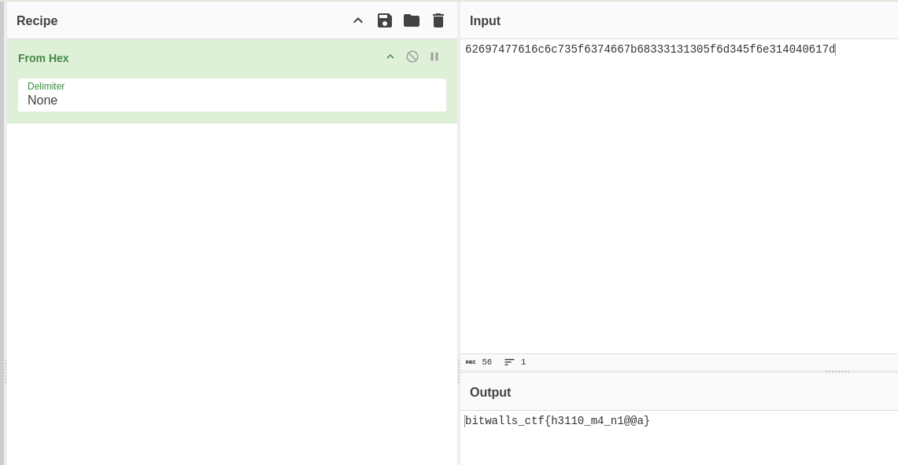

# Android Game Reverse Engineering — Coin Manipulation & Flag Extraction Walkthrough

## 1) Goal
Your goal was to analyze and modify an Android application to manipulate the in-game coin value and extract the flag

## 2) Tools
You could have used tool like [APK Easy Tool](https://github.com/mkcs121/APK-Easy-Tool/releases)  
Note: You should use latest version of the apktool: [https://sourceforge.net/projects/apktool.mirror/files/v2.10.0/](https://sourceforge.net/projects/apktool.mirror/files/v2.10.0/)

## 3) Steps to Decompile
Launch the `apkeasytool.exe` provided with APK Easy Tool.  
Load the given `.apk` file by selecting it via the GUI.  
Use the "Decompile" option to break apart the APK contents.

## 4) Finding the DLL
You'd find a DLL file: `Assembly-CSharp.dll`  
This file holds the majority of the game's logic and is built with Unity.

## 5) Analyzing the DLL
You could open this DLL with tools such as `dnSpy` or `ILSpy`.

## 6) Exploring Relevant Folder
You should explore the folder with all DLLs:

```
mytaxi\assets\bin\Data\Managed\
	Resources.ExternalUsage
	└── FlagShower
```



Within `FlagShower`, there’s a check involving a coin threshold:

```
if (Bank.Coins == -10000L)
```

## 7) Navigating to Coin Logic
Next, you should have navigated through the namespaces:

```
Assembly-CSharp.dll
	└── Client.Game
    	    └── CoinDisplaySystem
```

Within `CoinDisplaySystem`, you would encounter variables and methods responsible for the coin balance. You could either inspect the methods modifying the coin value or directly alter the class to return a required value.



## 8) Recompiling and Signing
After applying the necessary edits:  
Go back to APK Easy Tool.  
Use the "Compile" option to rebuild the modified APK and "Sign APK" to sign the application.  
Install and run the APK on an emulator or a test device.

## 9) Extracting the Flag
In the main menu, the button for revealing the flag would appear.  
Copy the given string.



## 10) Decoding the Flag
Lastly, you could use tool like `CyberChef` to convert the hex value into the flag.


